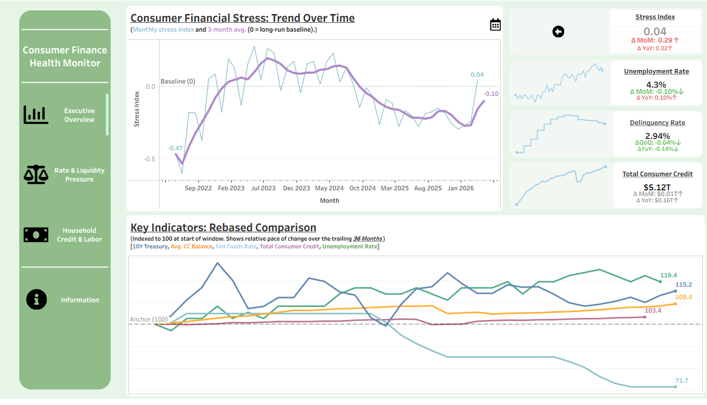

## Consumer Finance Health Monitor

A portfolio project showcasing end-to-end reporting design. This highlights skills across all stages beginning with initial EDA and planning, execution of the pipeline build, all the way through to creation and publishing of a comprehensive dashboard with plans for future iteration.

## Objective

Create a repeatable pipeline and dashboard that answers:

**Are consumer-finance stress signals above or below their normal range, and how are they changing over time?**

## Outcome

- Built an end-to-end medallion pipeline (`bronze` -> `silver` -> `gold`) in SQL Server.
- Loaded and standardized FRED economic time series with Python + T-SQL.
- Published a comprehensive dashboard to Tableau Public for executive and non-technical users with 3 tabs:
  - Executive Overview
  - Rate & Liquidity Pressure
  - Household Credit & Labor

For an in-depth look at pipeline build steps, validations, and evidence snapshots, <a href="https://github.com/carchuleta94/fantastic-guacamole/blob/main/docs/run_history.md"><u>CLICK HERE</u></a>.

## Live Dashboard

- Tableau Public: <a href="https://public.tableau.com/app/profile/christian.archuleta/viz/ConsumerFinanceHealthMonitor/ExecutiveOverview?publish=yes"><u>CLICK HERE</u></a>
- [](https://public.tableau.com/app/profile/christian.archuleta/viz/ConsumerFinanceHealthMonitor/ExecutiveOverview?publish=yes)

## Dashboard Preview

The image above is a quick preview. For full interactive access to all three tabs (Executive Overview, Rate & Liquidity Pressure, Household Credit & Labor), use the live dashboard link in the section above.

## What Each Tab Shows (No Finance Background Needed)

- **Executive Overview**: quick health check. KPI cards with sparklines show where things stand and their recent trajectory, the trend chart shows whether stress is rising or easing versus normal, and a rebased comparison shows how key indicators have moved relative to each other over the trailing 36 months.
- **Rate & Liquidity Pressure**: shows whether borrowing/funding conditions look tight or loose, using short-term rates and the 10Y-2Y spread.
- **Household Credit & Labor**: compares debt growth with unemployment and delinquency so you can see whether debt changes look manageable or more concerning.

## Data Sources

- **FRED API (Federal Reserve Economic Data)** for all indicators in this version.
- Data is public and aggregate (not individual-level consumer records).

## Core Metrics (Simple Definitions)

- **Stress Index**: composite signal of stress relative to each input's own history (`0` is long-run baseline).
- **Unemployment Rate**: share of the labor force actively looking for work but unemployed.
- **Delinquency Rate**: bank-reported credit card loan delinquency rate (quarterly series).
- **Total Consumer Credit**: total outstanding non-mortgage consumer debt (shown in trillions in the dashboard).

## Technical Architecture

### Medallion Layers

- **`bronze`**: raw API JSON payloads for replay and audit.
- **`silver`**: cleaned, typed observations by series/date.
- **`gold`**: monthly KPI fact table for BI consumption.

### Main Tables / Objects

- `fantastic_guacamole.bronze.fred_observation_raw`
- `fantastic_guacamole.silver.fred_series`
- `fantastic_guacamole.silver.fred_observation`
- `fantastic_guacamole.gold.dim_date`
- `fantastic_guacamole.gold.fact_consumer_finance_monthly`
- `fantastic_guacamole.ops.pipeline_run_log`
- `fantastic_guacamole.ops.silver_load_tracker`

## Repo Structure

- `src/` -> Python ingestion and utility scripts
- `SQL Server Warehouse/` -> DDL and stored procedures
- `docs/` -> validation snapshots, run history, dashboard assets
- `data/` -> intermediate/export files used during build

## Run Order (Local)

1. Create/update schemas and tables in SQL Server.
2. Run bronze ingestion (`src/load_bronze_fred_raw.py`).
3. Run silver load procedure.
4. Run gold build procedure.
5. Export dataset for Tableau Public refresh.

## Local Setup

### Prerequisites

- SQL Server local instance
- Python 3.12+
- ODBC Driver 17/18 for SQL Server

### Environment

1. Copy `.env.example` to `.env`
2. Set `FRED_API_KEY`

### Install Dependencies

```bash
python -m pip install python-dotenv requests pandas sqlalchemy pyodbc
```

## Notes / Limitations

- Tableau Public version uses manual CSV/Excel refresh (no live SQL connection).
- Delinquency is quarterly, so cadence differs from monthly series.
- This is a monitoring tool, not a forecasting model.

## Author

- Christian Archuleta
- GitHub: [https://github.com/archuleta94/fantastic-guacamole](https://github.com/archuleta94/fantastic-guacamole)
