# Run History

This log is intentionally simple and readable.
Each entry is a quick project snapshot: **what we did, what happened, and what comes next**.

---

## Snapshot Template

### [Date] [Step Name]
- **Step:** What was executed.
- **Outcome:** What happened (success/failure + short summary).
- **Evidence:** Tables/files/queries that prove the outcome.
- **Notes:** Important context, tradeoffs, or issues.
- **Next:** Immediate next action.

---

## 2026-05-04 Bronze Raw Load (Initial)
- **Step:** Ran `src/load_bronze_fred_raw.py` to ingest raw FRED payloads for selected series.
- **Outcome:** Bronze ingestion completed and run logging captured in DB.
- **Evidence:** New records in `bronze.fred_observation_raw` and `ops.pipeline_run_log`.
- **Notes:** Bronze intentionally stores full JSON payloads; flattening occurs in silver.
- **Next:** Parse and upsert into `silver.fred_series` and `silver.fred_observation`.

---

## 2026-05-04 Silver Load from Bronze (Stored Proc)
- **Step:** Executed `ops.usp_load_silver_from_bronze` to parse `bronze.fred_observation_raw.response_json` into typed rows and upsert into `silver.fred_series` + `silver.fred_observation` (batched at 1000 observation rows per batch).
- **Outcome:** Silver load completed successfully for run `288B3439-85C8-4454-BD46-F4F711975457`.
- **Evidence:**
  - `ops.silver_load_tracker`: final status `SUCCESS` for pipeline `load_silver_from_bronze` (`silver_load_tracker_id = 1`, `total_rows_staged = 61577`, `total_rows_inserted = 61577`, `total_rows_updated = 0`).
  - `ops.pipeline_run_log`: success summary row present for same run with staged/insert totals.
  - `silver.fred_observation` by-series counts reconcile to `61577` total rows.

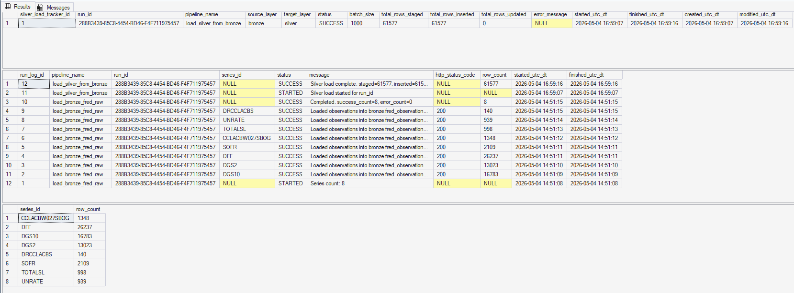

```sql
SELECT TOP 50 *
FROM ops.silver_load_tracker
ORDER BY silver_load_tracker_id DESC;

SELECT TOP 50 *
FROM ops.pipeline_run_log
ORDER BY run_log_id DESC;

SELECT series_id, COUNT(*) AS row_count
FROM silver.fred_observation
GROUP BY series_id
ORDER BY series_id;
```

- **Notes:** Bronze remains raw JSON payloads; silver stores flattened, typed observations with `source_raw_id` lineage back to bronze `raw_id`.
- **Next:** Run silver validation spot checks and lock monthly aggregation rules for gold.

---

## 2026-05-04 Silver Validation and Aggregation Decisions
- **Step:** Ran validation checks from `SQL Server Warehouse/silver_validation_queries.sql` after executing `ops.usp_load_silver_from_bronze`, including missingness checks, duplicate/date integrity checks, and April 2026 spot checks.
- **Outcome:** Silver quality checks passed and monthly aggregation logic for gold was finalized.
- **Evidence:**
  - `suspicious_missing_value_mismatch = 0`
  - `null_dates = 0`
  - Missingness rates were plausible for source frequency (daily market series ~4.2-4.3%; monthly/quarterly series near 0).

```sql
-- Spot Check 1: daily rates (Apr 2026) month_avg vs last value in month
DECLARE @y INT = 2026;
DECLARE @m INT = 4;
DECLARE @month_start date = DATEFROMPARTS(@y, @m, 1);
DECLARE @month_end   date = EOMONTH(@month_start);

WITH d AS (
    SELECT *
    FROM fantastic_guacamole.silver.fred_observation
    WHERE series_id IN ('DGS10','DGS2','DFF','SOFR')
      AND observation_date >= @month_start
      AND observation_date <= @month_end
      AND is_missing = 0
      AND observation_value IS NOT NULL
)
SELECT
    series_id,
    AVG(CAST(observation_value AS FLOAT)) AS month_avg,
    MAX(CASE WHEN observation_date = last_day.obs_date
             THEN CAST(observation_value AS FLOAT) END) AS last_value_in_month,
    MIN(observation_date) AS first_obs_date_in_month,
    MAX(observation_date) AS last_obs_date_in_month,
    COUNT(*) AS obs_days_in_month
FROM d
CROSS APPLY (
    SELECT MAX(observation_date) AS obs_date FROM d x WHERE x.series_id = d.series_id
) last_day
GROUP BY series_id
ORDER BY series_id;
```

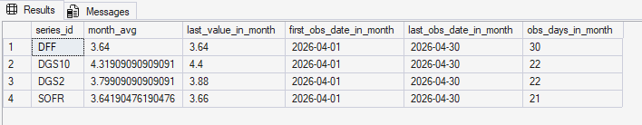

```sql
-- Spot Check 2: weekly credit-card balances (Apr 2026)
DECLARE @y2 INT = 2026;
DECLARE @m2 INT = 4;
DECLARE @month_start2 date = DATEFROMPARTS(@y2, @m2, 1);
DECLARE @month_end2   date = EOMONTH(@month_start2);

SELECT
    observation_date,
    observation_value
FROM fantastic_guacamole.silver.fred_observation
WHERE series_id = 'CCLACBW027SBOG'
  AND observation_date BETWEEN @month_start2 AND @month_end2
  AND is_missing = 0
  AND observation_value IS NOT NULL
ORDER BY observation_date;
```

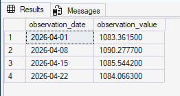

```sql
-- Spot Check 3: monthly series availability and recent values
SELECT
    series_id,
    MAX(observation_date) AS latest_observation_date
FROM fantastic_guacamole.silver.fred_observation
WHERE series_id IN ('UNRATE','TOTALSL')
  AND is_missing = 0
  AND observation_value IS NOT NULL
GROUP BY series_id
ORDER BY series_id;

SELECT
    series_id,
    observation_date,
    observation_value
FROM fantastic_guacamole.silver.fred_observation
WHERE series_id IN ('UNRATE','TOTALSL')
  AND is_missing = 0
  AND observation_value IS NOT NULL
  AND observation_date >= '2025-01-01'
ORDER BY series_id, observation_date DESC;
```

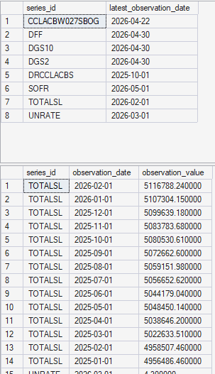

- **Notes:** Spot check 3 confirmed the April monthly query returning 0 rows was a release-timing issue (not a transform defect). Gold should preserve nulls for months without published values.
- **Next:** Build gold monthly procedure using locked rules:
  - Daily/weekly series -> monthly `AVG`
  - Monthly series (`TOTALSL`, `UNRATE`) -> native monthly value
  - Quarterly delinquency (`DRCCLACBS`) -> quarter-end month only (no forward fill in V1)
  - Derived spread -> `t10y2y_avg = dgs10_avg - dgs2_avg`

---

## 2026-05-04 Gold Validation (Monthly Fact)

- **Step:** Built/validated the monthly gold layer by executing `ops.usp_build_gold_consumer_finance_monthly` (after ensuring `gold.dim_date` coverage via dim-date refresh/seed logic).
- **Outcome:** Gold monthly fact populated successfully; pipeline logs show a completed gold build with staged monthly grain rows merged into `fantastic_guacamole.gold.fact_consumer_finance_monthly` (`row_count/staged = 1001`, `merge_affected = 1001` on the successful run shown in the screenshot).
- **Evidence:**
  - Queried recent monthly KPI rows from `fantastic_guacamole.gold.fact_consumer_finance_monthly` (rates, credit, labor, delinquency).
  - Confirmed `build_gold_consumer_finance_monthly` logged `SUCCESS` in `fantastic_guacamole.ops.pipeline_run_log`.
  - Observed expected NULLs where sources publish slower than daily market series (monthly/quarterly cadence) and `stress_index` remains NULL until explicitly implemented.

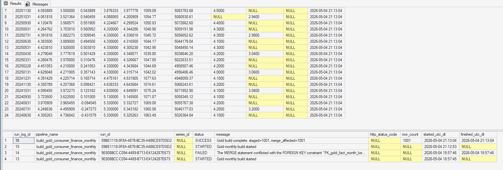

```sql
SELECT TOP 24
    month_key,
    dgs10_avg,
    dgs2_avg,
    t10y2y_avg,
    dff_avg,
    sofr_avg,
    cc_balance_avg,
    consumer_credit_total,
    unemployment_rate,
    cc_delinquency_rate,
    stress_index,
    load_ts_utc
FROM fantastic_guacamole.gold.fact_consumer_finance_monthly
ORDER BY month_key DESC;

SELECT TOP 30
    run_log_id,
    pipeline_name,
    run_id,
    status,
    row_count,
    message,
    started_utc_dt,
    finished_utc_dt
FROM fantastic_guacamole.ops.pipeline_run_log
WHERE pipeline_name = 'build_gold_consumer_finance_monthly'
ORDER BY run_log_id DESC;
```

- **Notes:** An initial gold attempt may fail if `gold.dim_date` is missing future month keys; dim-date refresh prevents FK issues on `month_key`.
- **Next:** Implement `stress_index` (simple v1 definition) and begin Tableau visuals against `fantastic_guacamole.gold.fact_consumer_finance_monthly`.

---

## 2026-05-05 Silver→Gold Reconciliation (Checks 1-4)

- **Step:** Executed targeted reconciliation checks between `fantastic_guacamole.silver.fred_observation` and `fantastic_guacamole.gold.fact_consumer_finance_monthly` before implementing `stress_index`.
- **Outcome:** Checks 1-4 passed. Gold metrics align with silver source logic, and quarterly mapping behavior is documented/expected.
- **Evidence:**
  - Validation 1: monthly average reconciliation matched between silver and gold for sampled series/month.
  - Validation 2: derived spread (`t10y2y_avg`) matches `dgs10_avg - dgs2_avg` within rounding tolerance.
  - Validation 3: monthly-series grain check returned `1` for targeted month (expected native monthly cadence).
  - Validation 4: quarterly delinquency values align to quarter-end month keys in gold, while silver can hold quarter-start observation dates.

```sql
-- Validation 1: silver monthly avg vs gold metric (example: DGS10)
DECLARE @month_end date = '2026-04-30';

SELECT AVG(CAST(observation_value AS FLOAT)) AS silver_avg
FROM fantastic_guacamole.silver.fred_observation
WHERE series_id = 'DGS10'
  AND EOMONTH(observation_date) = @month_end
  AND is_missing = 0
  AND observation_value IS NOT NULL;

SELECT dgs10_avg
FROM fantastic_guacamole.gold.fact_consumer_finance_monthly
WHERE month_key = CONVERT(INT, FORMAT(@month_end, 'yyyyMMdd'));
```

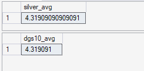

```sql
-- Validation 2: derived spread check
SELECT TOP 50
    month_key,
    dgs10_avg,
    dgs2_avg,
    t10y2y_avg,
    (dgs10_avg - dgs2_avg) AS expected_t10y2y
FROM fantastic_guacamole.gold.fact_consumer_finance_monthly
WHERE dgs10_avg IS NOT NULL
  AND dgs2_avg IS NOT NULL
ORDER BY month_key DESC;
```

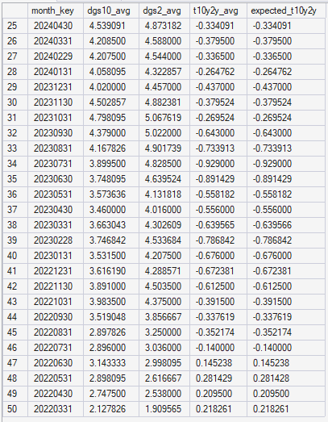

```sql
-- Validation 3: monthly series grain (expect one row for selected month)
DECLARE @month_end_v3 date = '2026-03-31';

SELECT COUNT(*) AS monthly_points_in_month
FROM fantastic_guacamole.silver.fred_observation
WHERE series_id = 'UNRATE'
  AND EOMONTH(observation_date) = @month_end_v3
  AND is_missing = 0
  AND observation_value IS NOT NULL;
```

```sql
-- Validation 4: quarterly delinquency placement/mapping checks
SELECT
    month_key,
    cc_delinquency_rate
FROM fantastic_guacamole.gold.fact_consumer_finance_monthly
WHERE cc_delinquency_rate IS NOT NULL
ORDER BY month_key DESC;

SELECT
    f.month_key,
    d.calendar_date,
    d.quarter_num,
    d.month_num,
    f.cc_delinquency_rate
FROM fantastic_guacamole.gold.fact_consumer_finance_monthly f
JOIN fantastic_guacamole.gold.dim_date d
  ON d.date_key = f.month_key
WHERE f.cc_delinquency_rate IS NOT NULL
ORDER BY f.month_key;
```

- **Notes:** Validation 3 and Validation 4 are intentionally text-only evidence in this log. This reconciliation block is the sign-off gate before composite-score implementation.
- **Next:** Execute Checks 5-6 (frontier lag + rerun idempotence), then implement `stress_index` v1.

---

## 2026-05-05 Silver→Gold Final Validation (Checks 5-6)

- **Step:** Executed final pre-`stress_index` checks for publication-lag behavior and rerun idempotence on the gold monthly fact.
- **Outcome:** Both checks passed. Publication cadence differences look expected near the frontier, and rerunning gold remains idempotent at monthly grain.
- **Evidence:**
  - Validation 5 showed months where high-frequency rate metrics exist while lower-frequency monthly/quarterly metrics are still pending publication (expected behavior; no artificial imputation required).
  - Validation 6 confirmed rerun stability: `fact_rows_before = 1001` and `fact_rows_after = 1001`, with repeated `SUCCESS` runs in `fantastic_guacamole.ops.pipeline_run_log`.

```sql
-- Validation 5: publication-lag sanity near reporting frontier
WITH m AS (
    SELECT
        month_key,
        dgs10_avg,
        dgs2_avg,
        dff_avg,
        sofr_avg,
        cc_balance_avg,
        consumer_credit_total,
        unemployment_rate,
        cc_delinquency_rate
    FROM fantastic_guacamole.gold.fact_consumer_finance_monthly
)
SELECT TOP 50
    month_key,
    CASE WHEN dgs10_avg IS NULL THEN 0 ELSE 1 END AS has_rates,
    CASE WHEN consumer_credit_total IS NULL THEN 0 ELSE 1 END AS has_total_sl,
    CASE WHEN unemployment_rate IS NULL THEN 0 ELSE 1 END AS has_unrate,
    CASE WHEN cc_delinquency_rate IS NULL THEN 0 ELSE 1 END AS has_delinq
FROM m
WHERE (dgs10_avg IS NOT NULL OR dff_avg IS NOT NULL)
  AND (consumer_credit_total IS NULL OR unemployment_rate IS NULL OR cc_delinquency_rate IS NULL)
ORDER BY month_key DESC;
```

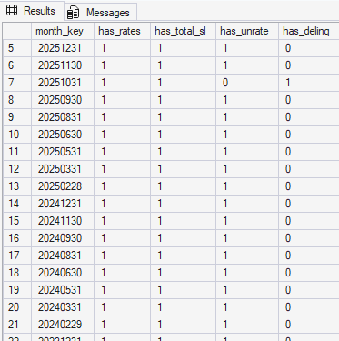

```sql
-- Validation 6: rerun idempotence check
SELECT COUNT(*) AS fact_rows_before
FROM fantastic_guacamole.gold.fact_consumer_finance_monthly;

EXEC fantastic_guacamole.ops.usp_build_gold_consumer_finance_monthly;
EXEC fantastic_guacamole.ops.usp_build_gold_consumer_finance_monthly;

SELECT COUNT(*) AS fact_rows_after
FROM fantastic_guacamole.gold.fact_consumer_finance_monthly;

SELECT TOP 10
    run_log_id,
    pipeline_name,
    run_id,
    status,
    row_count,
    message,
    started_utc_dt,
    finished_utc_dt
FROM fantastic_guacamole.ops.pipeline_run_log
WHERE pipeline_name = 'build_gold_consumer_finance_monthly'
ORDER BY run_log_id DESC;
```

- **Notes:** A non-changing row count across reruns (`1001 -> 1001`) indicates idempotent load behavior at the fact-table grain. Validation 6 is intentionally text-only evidence in this log.
- **Next:** Implement and validate `stress_index` v1, then harden proc observability.

---

## 2026-05-05 Stress Index Validation (Post-Implementation)

- **Step:** Updated `ops.usp_build_gold_consumer_finance_monthly` to compute `stress_index` from z-scored components using the maintainability-first stats CTE approach, then re-ran the gold build.
- **Outcome:** Stress index populated as expected for rows with sufficient component coverage, with reasonable distribution characteristics.
- **Evidence:**
  - Gold run logs show `SUCCESS` with readable action counts (`inserted`, `updated`) after merge-change detection update.
  - Stress index populated in `fantastic_guacamole.gold.fact_consumer_finance_monthly` (no longer entirely NULL).
  - Distribution sanity check returned:
    - `non_null_stress_rows = 940`
    - `min_stress = -1.8547`
    - `max_stress = 2.4777`
    - `avg_stress = -0.0538`
  - Dim-date FK integrity remained clean (`missing_dim_date_keys = 0`).

- **Validation 1 (stress field population):**
```sql
SELECT TOP 40
    month_key,
    unemployment_rate,
    cc_delinquency_rate,
    dff_avg,
    t10y2y_avg,
    stress_index
FROM fantastic_guacamole.gold.fact_consumer_finance_monthly
ORDER BY month_key DESC;
```
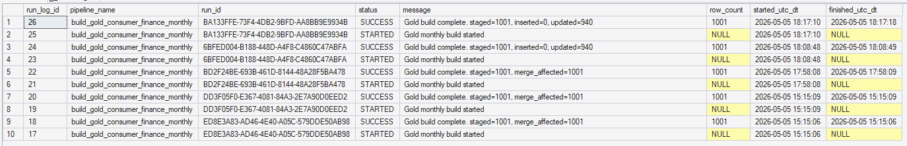

- **Validation 2 (stress distribution sanity):**
```sql
SELECT
    COUNT(*) AS non_null_stress_rows,
    MIN(stress_index) AS min_stress,
    MAX(stress_index) AS max_stress,
    AVG(CAST(stress_index AS FLOAT)) AS avg_stress
FROM fantastic_guacamole.gold.fact_consumer_finance_monthly
WHERE stress_index IS NOT NULL;
```
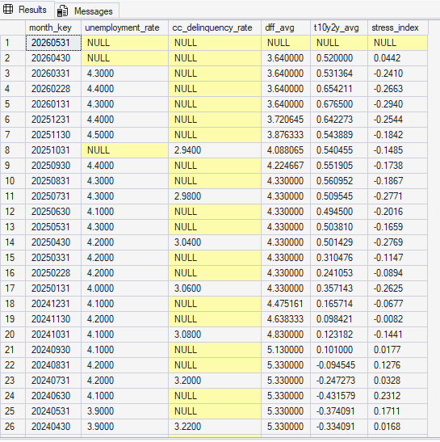

- **Validation 3 (dim-date FK integrity):**
```sql
SELECT COUNT(*) AS missing_dim_date_keys
FROM fantastic_guacamole.gold.fact_consumer_finance_monthly f
LEFT JOIN fantastic_guacamole.gold.dim_date d
  ON d.date_key = f.month_key
WHERE d.date_key IS NULL;
```
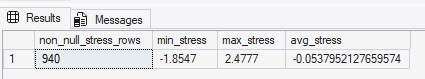

- **Notes:** Null-elimination warnings during aggregate calculations are expected because slower-cadence series naturally contain NULLs in frontier months.
- **Next:** Validate downstream dashboard calculations in Tableau and document stress-index interpretation in README.

---

## 2026-05-05 Proc Observability + Change-Detection Refactor

- **Step:** Refactored both gold and silver stored procedures for cleaner operations telemetry and idempotent-style updates.
- **Outcome:** Logs are more informative and reruns are easier to reason about.
- **Evidence:**
  - `ops.usp_build_gold_consumer_finance_monthly` now logs `inserted` vs `updated` counts and uses run-level timestamp variables.
  - `ops.usp_load_silver_from_bronze` successfully processed a new bronze run after refactor:
    - `run_id = E3040F9B-DE22-4699-8DD4-2BE7270A43C6`
    - `status = SUCCESS`
    - `total_rows_staged = 48557`
    - `total_rows_inserted = 3`
    - `total_rows_updated = 48554`
  - Silver tracker and pipeline logs show coherent started/finished timestamps for the run.

```sql
SELECT TOP 10
    run_log_id,
    pipeline_name,
    run_id,
    status,
    message,
    started_utc_dt,
    finished_utc_dt
FROM fantastic_guacamole.ops.pipeline_run_log
WHERE pipeline_name IN ('build_gold_consumer_finance_monthly','load_silver_from_bronze')
ORDER BY run_log_id DESC;

SELECT TOP 10
    silver_load_tracker_id,
    run_id,
    pipeline_name,
    status,
    total_rows_staged,
    total_rows_inserted,
    total_rows_updated,
    started_utc_dt,
    finished_utc_dt
FROM fantastic_guacamole.ops.silver_load_tracker
ORDER BY silver_load_tracker_id DESC;
```

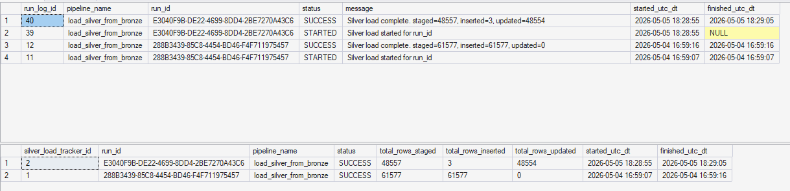

- **Notes:** High update counts on first post-refactor reruns are expected when new logic or derived fields are introduced.
- **Next:** Final documentation pass (`README` + method notes) and Tableau build-out.

---

## 2026-05-05 Tableau Public Final Dataset Export

- **Step:** Finalized the Tableau dataset by exporting the gold-layer query result to CSV for use in Tableau Public.
- **Outcome:** Data source finalized for dashboard build/publish workflow. Export-based refresh was used because Tableau Public does not support a live SQL Server connection in this setup.
- **Evidence:**

```sql
SELECT
    f.month_key,
    d.calendar_date,
    d.year_num,
    d.quarter_num,
    d.month_num,
    d.month_name,
    f.dgs10_avg,
    f.dgs2_avg,
    f.t10y2y_avg,
    f.dff_avg,
    f.sofr_avg,
    f.cc_balance_avg,
    f.consumer_credit_total,
    f.unemployment_rate,
    f.cc_delinquency_rate,
    f.stress_index,
    f.load_ts_utc
FROM fantastic_guacamole.gold.fact_consumer_finance_monthly f
INNER JOIN fantastic_guacamole.gold.dim_date d
    ON d.date_key = f.month_key
ORDER BY d.calendar_date;
```

- **Notes:** This query is the authoritative extract used to populate the Tableau workbook data source file.
- **Next:** Publish dashboard, capture final screenshots, and complete README/dashboard-link updates. Next Iteration (v2) will update data source to use a python process to fill a google sheets document on a regular schedule to simulate a direct data source connection.


---

## SQL Snippet: Latest Run Summary

Run this in SQL Server to quickly summarize recent pipeline activity.

```sql
SELECT TOP 50
    run_log_id,
    pipeline_name,
    run_id,
    series_id,
    status,
    row_count,
    http_status_code,
    started_utc_dt,
    finished_utc_dt,
    message
FROM ops.pipeline_run_log
ORDER BY run_log_id DESC;
```

## SQL Snippet: Final Status By Run

```sql
WITH ranked AS (
    SELECT
        pipeline_name,
        run_id,
        status,
        message,
        started_utc_dt,
        ROW_NUMBER() OVER (
            PARTITION BY pipeline_name, run_id
            ORDER BY run_log_id DESC
        ) AS rn
    FROM ops.pipeline_run_log
)
SELECT
    pipeline_name,
    run_id,
    status AS final_status,
    started_utc_dt AS last_log_ts_utc,
    message AS final_message
FROM ranked
WHERE rn = 1
ORDER BY last_log_ts_utc DESC;
```

