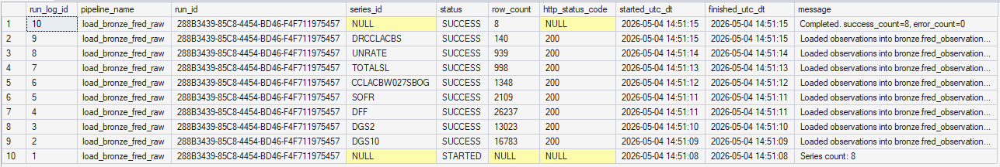

# Run History

## 2026-05-04 Bronze Raw Load (Initial)
- **Step:** Ran `src/load_bronze_fred_raw.py` to ingest raw FRED payloads for selected series.
- **Outcome:** Bronze ingestion completed and run logging captured in DB.
- **Evidence:** New records in `bronze.fred_observation_raw` and `ops.pipeline_run_log`.
- **Notes:** Bronze intentionally stores full JSON payloads; flattening occurs in silver.
- **Next:** Parse and upsert into `silver.fred_series` and `silver.fred_observation`.




## 2026-05-04 Silver Load from Bronze (Stored Proc)

- **Step:** Executed `ops.usp_load_silver_from_bronze` to parse `bronze.fred_observation_raw.response_json` into typed rows and upsert into `silver.fred_series` + `silver.fred_observation` (batched at 1000 observation rows per batch).
- **Outcome:** Silver load completed successfully for run
- **Evidence:**
  - `ops.silver_load_tracker`: final status `SUCCESS` for pipeline `load_silver_from_bronze`
  - `ops.pipeline_run_log`: `SUCCESS` summary row for the same `run_id`


```sql
SELECT TOP 50 *
FROM ops.silver_load_tracker
ORDER BY silver_load_tracker_id DESC;

SELECT TOP 50 *
FROM ops.pipeline_run_log
ORDER BY run_log_id DESC;

SELECT series_id, COUNT(*) AS row_count
FROM silver.fred_observation
GROUP BY series_id
ORDER BY series_id;
```

- **Notes:** Bronze remains raw JSON payloads; silver stores flattened, typed observations with `source_raw_id` lineage back to bronze `raw_id`.
- **Next:** Build gold monthly aggregation + `stress_index` logic, then Tableau wiring against `gold.fact_consumer_finance_monthly`.

---

## SQL Snippet: Latest Run Summary

Run this in SQL Server to quickly summarize recent pipeline activity.

```sql
SELECT TOP 50
    run_log_id,
    pipeline_name,
    run_id,
    series_id,
    status,
    row_count,
    http_status_code,
    started_utc_dt,
    finished_utc_dt,
    message
FROM ops.pipeline_run_log
ORDER BY run_log_id DESC;
```

## SQL Snippet: Final Status By Run

```sql
WITH ranked AS (
    SELECT
        pipeline_name,
        run_id,
        status,
        message,
        started_utc_dt,
        ROW_NUMBER() OVER (
            PARTITION BY pipeline_name, run_id
            ORDER BY run_log_id DESC
        ) AS rn
    FROM ops.pipeline_run_log
)
SELECT
    pipeline_name,
    run_id,
    status AS final_status,
    started_utc_dt AS last_log_ts_utc,
    message AS final_message
FROM ranked
WHERE rn = 1
ORDER BY last_log_ts_utc DESC;
```

